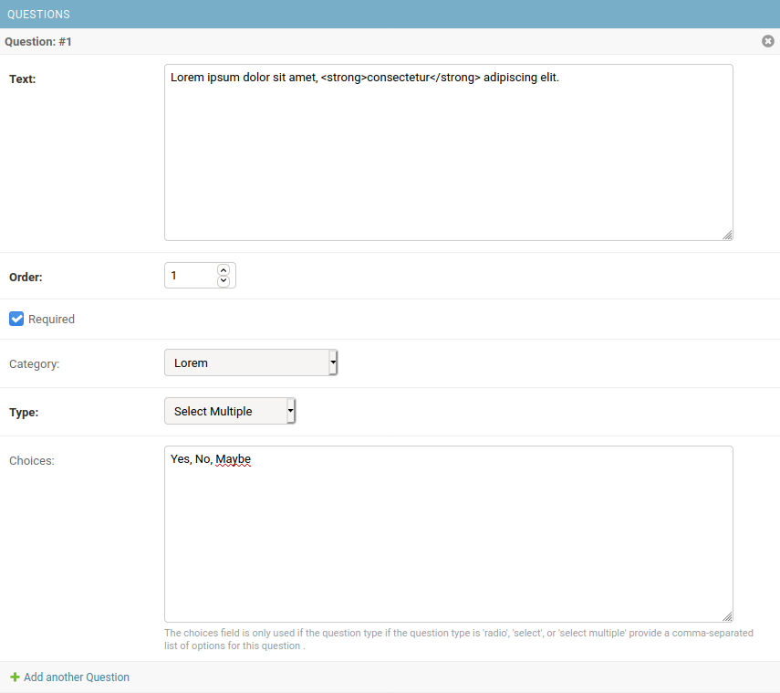
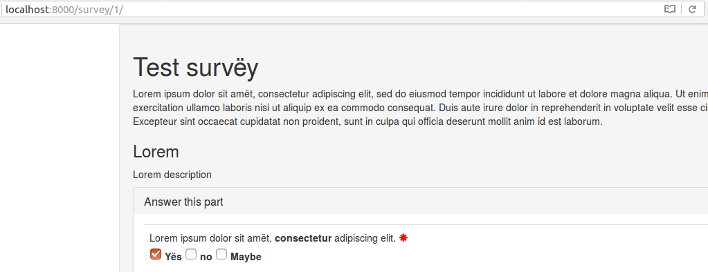
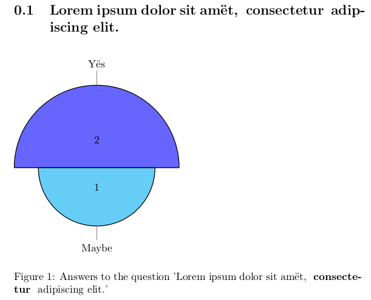
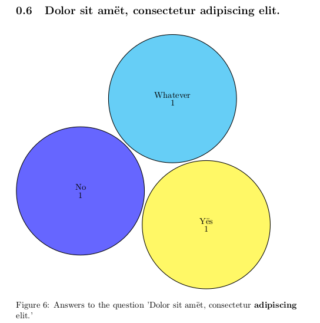
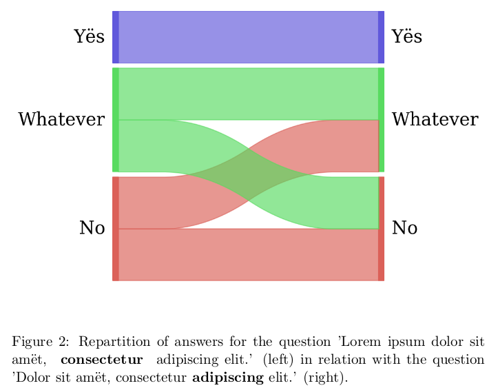
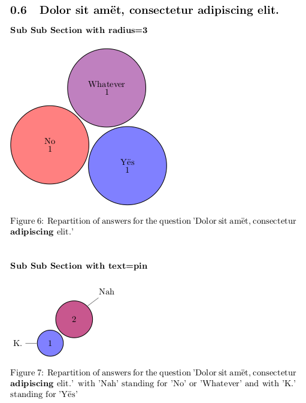
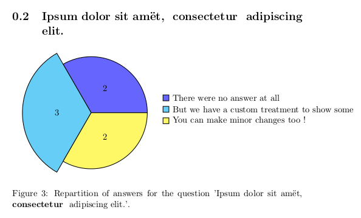

# Django survey

A django survey app, based on and compatible with "django-survey".
You will be able to migrate your data from an ancient version of
django-survey, but it has been ported to python 3 and you can export results as
CSV or PDF using your native language.

If you want the latest version still compatible with python 2.7 you need a
version < 1.3.0.

Professional support for django-survey-and-report is available as part of the [Tidelift Subscription](https://tidelift.com/subscription/pkg/pypi-django-survey-and-report?utm_source=pypi-django-survey-and-report&utm_medium=referral&utm_campaign=enterprise)

## Table of contents

* [Language available](#language-available)
* [Getting started](#getting-started)
* [Making a survey](#making-a-survey)
* [Generating a pdf report from the survey's result](#generating-a-pdf-report-from-the-surveys-result)
  * [Basic example](#basic-example)
  * [Sankey's diagram](#sankey-diagram)
  * [Advanced example](#advanced-example)
  * [Implementing a custom treatment](#implementing-a-custom-treatment)
* [Credit](#credits)

## Language available

The software is developed in english. Other available languages are :

* [x] Brazilian-Portuguese thanks to [Rafael Capaci](https://github.com/capaci)
* [x] Chinese thanks to [朱聖黎 (Zhu Sheng Li)](https://github.com/digglife/)
* [x] French thanks to [Pierre Sassoulas](https://github.com/Pierre-Sassoulas/)
* [x] German thanks to [Georg Elsas](https://github.com/gjelsas)
* [x] Indonesian thanks to [Dhana Dhira](https://github.com/ddhira123)
* [x] Japanese thanks to [Nobukuni Suzue](https://github.com/nsuzue/)
* [x] Spanish thanks to [Javier Ordóñez](https://github.com/ordonja/)
* [x] Russian thanks to [Vlad M.](https://github.com/manchos/)
* [x] Polish thanks to [Daniel Horner](https://github.com/d-horner/)

## Getting started

Add `django-survey-and-report` to your requirements and get it with pip.

~~~~bash
echo 'django-survey-and-report' >> requirements.txt
pip install -r requirements.txt
~~~~

Add `bootstrapform` and `survey` in the `INSTALLED_APPS` in your settings :

~~~~python
INSTALLED_APPS = [
	# Your own installed apps here
]

from pathlib import Path

CSV_DIRECTORY = Path("csv") # Define the directory where csv are exported
TEX_DIRECTORY = Path("tex") # Define the directory where tex files and pdf are exported

INSTALLED_APPS += [
	'bootstrapform',
	'survey'
]
~~~~

Add an URL entry to your project’s urls.py, for example:

~~~python
from django.conf import settings
from django.conf.urls import include, url

urlpatterns = [
    # Your own url pattern here
]

if 'survey' in settings.INSTALLED_APPS:
    urlpatterns += [
        url(r'^survey/', include('survey.urls'))
    ]
~~~~

Note: you can use whatever you wish as the URL prefix.

You can also change some options:

~~~~python
# Permit to open the csv in excel without problem with separator
# Using this trick : https://superuser.com/a/686415/567417
EXCEL_COMPATIBLE_CSV = True

# The separator for questions (Default to ",")
CHOICES_SEPARATOR = "|"

# What is shown in export when the user do not answer (Default to "Left blank")
USER_DID_NOT_ANSWER = "NAA"

# Path to the Tex configuration file (default to an internal file that should be sufficient)
from pathlib import Path
TEX_CONFIGURATION_FILE = Path("tex", "tex.conf")

# Default color for exported pdf pie (default to "red!50")
SURVEY_DEFAULT_PIE_COLOR = "blue!50"
~~~~

To uninstall `django-survey-and-report`, simply comment out or remove the
'survey' line in your `INSTALLED_APPS`.

If you want to use the pdf rendering you need to install `xelatex`. If you're
using the Sankey's diagram generation you will also have to install `python-tk`
(for python 2.7) or `python3-tk` (for python 3.x).

## Making a survey

Using the admin interface you can create surveys, add questions, give questions
categories, and mark them as required or not. You can define choices for answers
using comma separated words.

The front-end survey view then automatically populates based on the questions
that have been defined and published in the admin interface. We use bootstrap3
to render them.

Submitted responses can be viewed via the admin backend, in an exported csv
or in a pdf generated with latex.

## Generating a pdf report from the survey's result

There is a default configuration for PDF generation, but you might want to change
`TEX_CONFIGURATION_FILE` for better results (in particular for language other
than english).

You can manage the way the report is created in a yaml file, globally, survey
by survey, or question by question. In order to render pdf you will need to
install `xelatex`. You will also need python3-tk for sankey's diagram.

The results are generated for the server only when needed, but you can force
it as a developer with:

~~~~bash
python manage.py exportresult -h
~~~~

Following is an example of a configuration file. you can generate one with:

~~~~bash
python manage.py generatetexconf -h
~~~~

### Basic example

~~~~yaml
generic:
  document_option: 11pt
'Test survëy':
  document_class: report
  questions:
    'Lorem ipsum dolor sit amët, <strong> consectetur </strong> adipiscing elit.':
      chart:
        type: polar
        text: pin
    'Dolor sit amët, consectetur<strong>  adipiscing</strong>  elit.':
      chart:
        type: cloud
        text: inside
~~~~

The pdf is then generated using the very good pgf-pie library.

### Sankey diagram

If you installed python3-tk, you can also show the relation between two
questions using a sankey diagram :

~~~~yaml
'Lorem ipsum dolor sit amët, <strong> consectetur </strong> adipiscing elit.':
  chart:
    type: sankey
    question: 'Dolor sit amët, consectetur<strong>  adipiscing</strong>  elit.'
~~~~

You get this as a result:

### Advanced example

You can also limit the answers shown by cardinality, filter them, group them
together and choose the color for each answer or group of answers.

If you use this configuration for the previous question:
~~~~yaml
'Test survëy':
  'Dolor sit amët, consectetur<strong>  adipiscing</strong>  elit.':
    multiple_charts:
      'Sub Sub Section with radius=3':
        color:
          Yës: blue!50
          No: red!50
          Whatever: red!50!blue!50
        radius: 3
      'Sub Sub Section with text=pin':
        group_together:
          Nah:
            - No
            - Whatever
          K.:
            - Yës
        color:
          Nah: blue!33!red!66
          K.: blue!50
        text: pin
    chart:
      radius: 1
      type: cloud
      text: inside
~~~~

You get this as a result:

### Implementing a custom treatment

If you want to make your own treatment you can use your own class, for example.

Configuration:

~~~~yaml
'Test survëy':
  questions:
    'Ipsum dolor sit amët, <strong> consectetur </strong>  adipiscing elit.':
      chart:
        type: survey.tests.exporter.tex.CustomQuestion2TexChild
~~~~

Code in `survey.tests.exporter.tex.CustomQuestion2TexChild`:

~~~~python
from survey.exporter.tex.question2tex_chart import Question2TexChart

class CustomQuestion2TexChild(Question2TexChart):

    def get_results(self):
        self.type = "polar"
        return """        2/There were no answer at all,
        3/But we have a custom treatment to show some,
        2/You can make minor changes too !"""
~~~~

Result:

For a full example of a configuration file look at `example_conf.yaml` in doc,
you can also generate your configuration file with
`python manage.py generatetexconf -h`, it will create the default skeleton
for every survey and question.

To guide you during the python development, you can read:

* The default reporter for PieChart in `Question2TexChart` : https://github.com/Pierre-Sassoulas/django-survey/blob/master/survey/exporter/tex/question2tex_chart.py#L13
* The Sankey reporter in `Question3TexSankey` : https://github.com/Pierre-Sassoulas/django-survey/blob/master/survey/exporter/tex/question2tex_sankey.py#L15
* The Raw reporter in `Question2TexRax` : https://github.com/Pierre-Sassoulas/django-survey/blob/master/survey/exporter/tex/question2tex_raw.py.

Do not hesitate to make a pull request with your new exporter if it can be of interest
for others I'll integrate it.

## Credits

Based on [jessykate's django-survey](https://github.com/jessykate/django-survey),
and contribution by jibaku, joshualoving, and ijasperyang in forks of jessykate's project.

We use [anazalea's pySankey](https://github.com/anazalea/pySankey) for sankey's
diagram during reporting.
