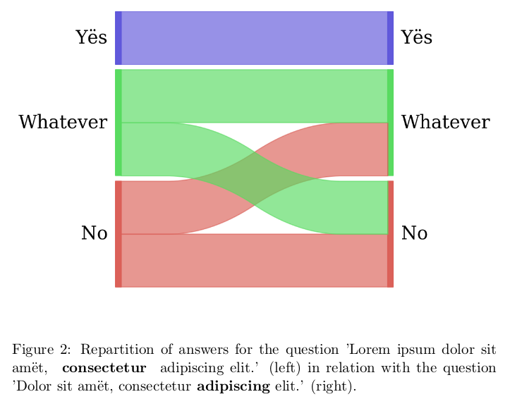
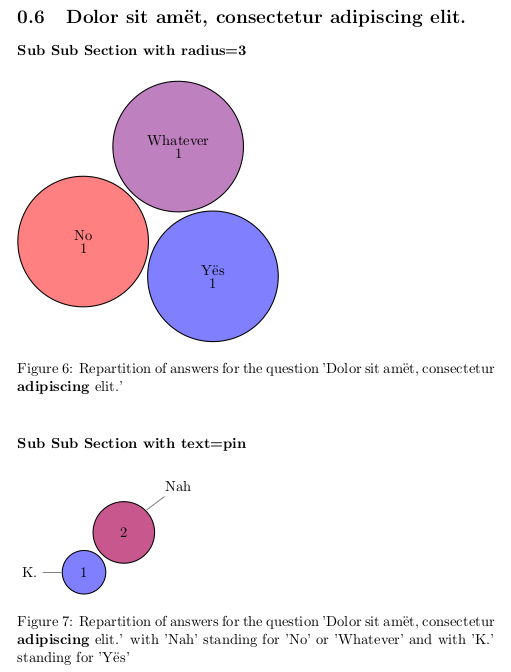

# Django survey

A django survey app, based on and compatible with "django-survey".
You will be able to migrate your data from an ancient version of
django-survey, but it has been ported to python 3 and you can export results as
CSV or PDF using your native language.

If you want the latest version still compatible with python 2.7 you need a
version < 1.3.0.

## Table of contents

* [Getting started](https://github.com/Pierre-Sassoulas/django-survey#getting-started)
* [Making a survey](https://github.com/Pierre-Sassoulas/django-survey#making-a-survey)
* [Generating a pdf report from the survey's result](https://github.com/Pierre-Sassoulas/django-survey#generating-a-pdf-report-from-the-surveys-result)
  * [Basic example](https://github.com/Pierre-Sassoulas/django-survey#basic-example)
  * [Sankey's diagram](https://github.com/Pierre-Sassoulas/django-survey#sankey-diagram)
  * [Advanced example](https://github.com/Pierre-Sassoulas/django-survey#advanced-example)
  * [Implementing a custom treatment](https://github.com/Pierre-Sassoulas/django-survey#implementing-a-custom-treatment)
* [Contributing as a developper](https://github.com/Pierre-Sassoulas/django-survey#contributing-as-a-developper)
  * [Development environement](https://github.com/Pierre-Sassoulas/django-survey#development-environement)
  * [Test](https://github.com/Pierre-Sassoulas/django-survey#test)
  * [Coverage](https://github.com/Pierre-Sassoulas/django-survey#coverage)
  * [Sorting imports](https://github.com/Pierre-Sassoulas/django-survey#sorting-imports)
  * [Lint](https://github.com/Pierre-Sassoulas/django-survey#lint-)
* [Translating the project](https://github.com/Pierre-Sassoulas/django-survey#translating-the-project)
  * [Language available](https://github.com/Pierre-Sassoulas/django-survey#language-available)
  * [As a developper](https://github.com/Pierre-Sassoulas/django-survey#as-a-developper)
  * [As a translator](https://github.com/Pierre-Sassoulas/django-survey#as-a-translator)
* [Credit](https://github.com/Pierre-Sassoulas/django-survey#credits)

## Getting started

Add `django-survey-and-report` to your requirements and get it with pip.

~~~~bash
echo 'django-survey-and-report' > requirements.txt
pip install -r requirements.txt
~~~~

Add `bootstrapform` and `survey` in the `INSTALLED_APPS` in your settings :

~~~~python
INSTALLED_APPS = [
	# Your own installed apps here
]

INSTALLED_APPS += [
	'bootstrapform',
	'survey'
]
~~~~

Add an URL entry to your project’s urls.py, for example:

~~~python
from django.conf import settings
from django.conf.urls import include, url

urlpatterns = [
    # Your own url pattern here
]

if 'survey' in settings.INSTALLED_APPS:
    urlpatterns += [
        url(r'^survey/', include('survey.urls'))
    ]
~~~~

Note: you can use whatever you wish as the URL prefix.

To uninstall `django-survey-and-report`, simply comment out or remove the
'survey' line in your `INSTALLED_APPS`.

If you want to use the pdf rendering with the Sankey's diagram generation
you will have to install python-tk (for python 2.7) or python3-tk (for python 3.x).

## Making a survey

Using the admin interface you can create surveys, add questions, give questions
categories, and mark them as required or not. You can define choices for answers
using comma separated words.

The front-end survey view then automatically populates based on the questions
that have been defined and published in the admin interface. We use bootstrap3
to render them.

Submitted responses can be viewed via the admin backend, in an exported csv
or in a pdf generated with latex.

## Generating a pdf report from the survey's result

You can manage the way the report is created in a yaml file, globally, survey
by survey, or question by question. In order to render pdf you will need to
install texlive and python-tk or python3-tk for sankey's diagram.

The results are generated for the server only when needed, but you can force
it as a developper with:

~~~~bash
python manage.py exportresult -h
~~~~

Following is an example of a configuration file. you can generate one with:

~~~~bash
python manage.py generatetexconf -h
~~~~

### Basic example

~~~~yaml
generic:
  document_option: 11pt
'Test survëy':
  document_class: report
  questions:
    'Lorem ipsum dolor sit amët, <strong> consectetur </strong> adipiscing elit.':
      chart:
        type: polar
        text: pin
    'Dolor sit amët, consectetur<strong>  adipiscing</strong>  elit.':
      chart:
        type: cloud
        text: inside
~~~~

The pdf is then generated using the very good pgf-pie library.

### Sankey diagram

If you installed python3-tk, you can also show the relation between two
questions using a sankey diagram :

~~~~yaml
'Lorem ipsum dolor sit amët, <strong> consectetur </strong> adipiscing elit.':
  chart:
    type: sankey
    question: 'Dolor sit amët, consectetur<strong>  adipiscing</strong>  elit.'
~~~~

You get this as a result:

### Advanced example

You can also limit the answers shown by cardinality, filter them, group them
together and choose the color for each answer or group of answers.

If you use this configuration for the previous question:
~~~~yaml
'Test survëy':
  'Dolor sit amët, consectetur<strong>  adipiscing</strong>  elit.':
    multiple_charts:
      'Sub Sub Section with radius=3':
        color:
          Yës: blue!50
          No: red!50
          Whatever: red!50!blue!50
        radius: 3
      'Sub Sub Section with text=pin':
        group_together:
          Nah:
            - No
            - Whatever
          K.:
            - Yës
        color:
          Nah: blue!33!red!66
          K.: blue!50
        text: pin
    chart:
      radius: 1
      type: cloud
      text: inside
~~~~

You get this as a result:

### Implementing a custom treatment

If you want to make your own treatment you can use your own class, for example.

Configuration:
~~~~yaml
'Test survëy':
  questions:
    'Ipsum dolor sit amët, <strong> consectetur </strong>  adipiscing elit.':
      chart:
        type: survey.tests.exporter.tex.CustomQuestion2TexChild
~~~~

Code in `survey.tests.exporter.tex.CustomQuestion2TexChild`:

~~~~python
from survey.exporter.tex.question2tex_chart import Question2TexChart

class CustomQuestion2TexChild(Question2TexChart):

    def get_results(self):
        self.type = "polar"
        return """        2/There were no answer at all,
        3/But we have a custom treatment to show some,
        2/You can make minor changes too !"""
~~~~

Result:

For a full example of a configuration file look at `example_conf.yaml` in doc,
you can also generate your configuration file with
`python manage.py generatetexconf -h`, it will create the default skeleton
for every survey and question.

## Contributing as a developer

### Development environment

This is the typical command you should do to get started:

~~~~bash
python3 -m venv venv/ # Create virtualenv
source venv/bin/activate # Activate virtualenv
pip3 install -e ".[dev]" # Install dev requirements
pre-commit install # Install pre-commit hook framework
python3 manage.py migrate # Create database
python3 manage.py createsuperuser
python3 manage.py loaddata survey/tests/testdump.json # Load test data
python3 manage.py runserver # Launch server
~~~~

### Committing code

#### Launching tests

~~~~bash
python3 manage.py test survey
~~~~

#### Adding test data

If you want to dump a test database after adding data to it, this is
the command to have a minimal diff :

~~~~bash
python3 manage.py dumpdata --format json -e contenttypes -e admin -e auth.Permission
-e sessions.session -e sites.site --natural-foreign --indent 1
-o survey/tests/testdump.json
~~~~

#### Launching coverage

~~~~bash
coverage run --source=survey --omit=survey/migrations/* ./manage.py test
coverage html
xdg-open htmlcov/index.html
~~~~

#### Applying Lint

We're using `pre-commit`, it should take care of linting during commit.

## Translating the project

Django survey's is available in multiple language.
Your contribution would be very appreciated if you
know a language that is not yet available.

### Language available

The software is developed in english. Other available languages are :

* [x] Chinese thanks to [朱聖黎 (Zhu Sheng Li)](https://github.com/digglife/)
* [x] French thanks to [Pierre Sassoulas](https://github.com/Pierre-Sassoulas/)
* [x] Japanese thanks to [Nobukuni Suzue](https://github.com/nsuzue/)
* [x] Spanish thanks to [Javier Ordóñez](https://github.com/ordonja/)
* [x] Russian thanks to [Vlad M.](https://github.com/manchos/)

### As a developper

If your language do not exists add it in the `LANGUAGE` variable in the
settings, like [here](https://github.com/Pierre-Sassoulas/django-survey/commit/ee3bdba26c303ad12fc4584938e724b39223faa9#diff-bdf3ecebd8379ca98cc89e545fc90899).
Do not forget to credit yourself like in the header seen
[here](https://github.com/Pierre-Sassoulas/django-zxcvbn-password-validator/commit/274d7c9b27268a0455f80ea518c452532b970ea4#diff-8015f170326f20998060314fda9b92b1)

Then you can translate with :

~~~~bash
python3 manage.py makemessages
# python manage.py createsuperuser ? (You need to login for rosetta)
python3 manage.py runserver
# Access http://localhost:8000/admin to login
# Then go to http://localhost:8000/rosetta to translate
python3 manage.py makemessages --no-obsolete --no-wrap
git add survey/locale/
...
~~~~

If your language is not yet available in rosetta,
[this stack overflow question](https://stackoverflow.com/questions/12946830/)
should work even for language not handled by django.

### As a translator

If you're not a developper, open an issue on github and ask for a .po
file in your language. I will generate it for you, so you can edit it with an
online editor. I will then create the .po and commit them, so you can edit them
with your github account or integrate it myself if you do not have one.
You will be credited
[here](https://github.com/Pierre-Sassoulas/django-survey#language-available).

## Credits

Based on [jessykate's django-survey](https://github.com/jessykate/django-survey),
and contribution by jibaku, joshualoving, and ijasperyang in forks of jessykate's project.

We use [anazalea's pySankey](https://github.com/anazalea/pySankey) for sankey's
diagram during reporting.
